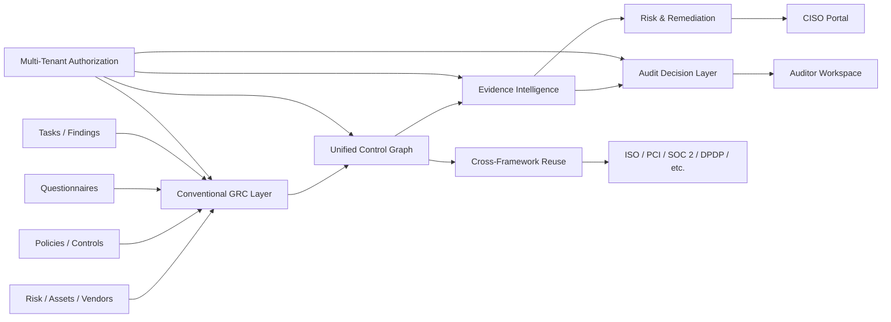
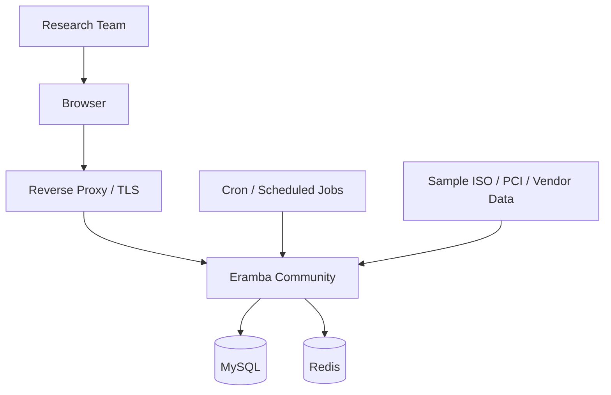
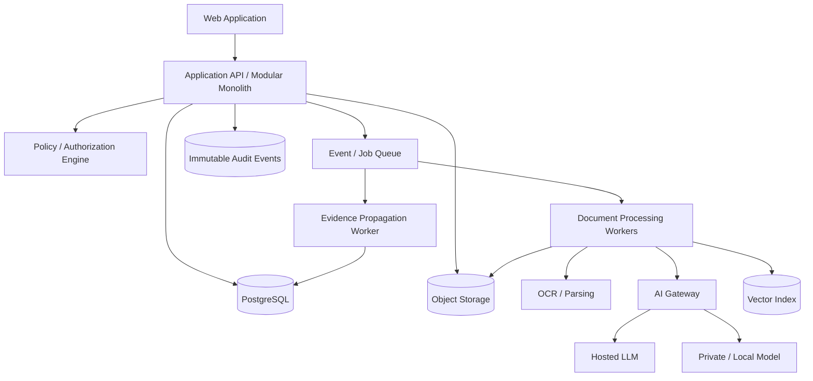
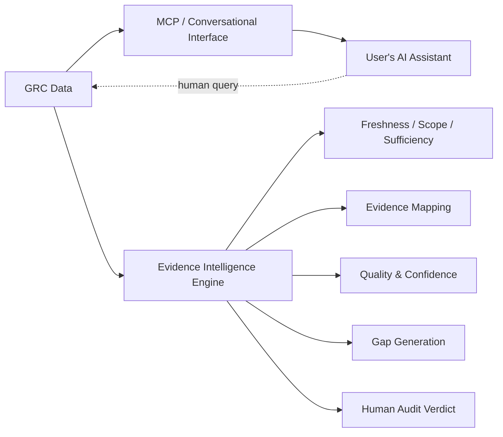
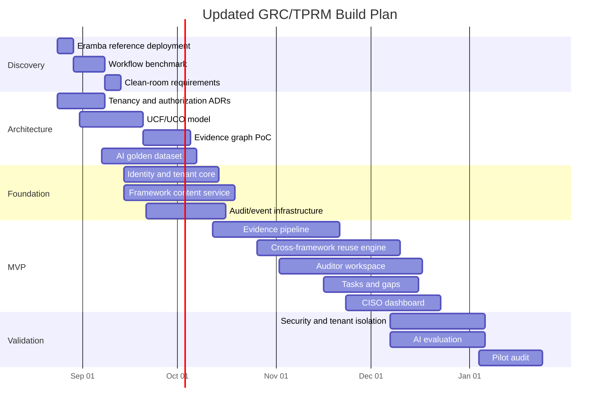

# Eramba-Informed Update to the GRC & TPRM Build Strategy

## Executive summary

Eramba is highly relevant to the proposed AI-powered GRC/TPRM platform in your concept note because it provides a mature reference implementation for many conventional GRC workflows: compliance management, risk management, internal controls, policies, third parties, audit findings, projects, access management, questionnaires/online assessments, reporting, APIs, and increasingly AI-facing integration. Eramba's current public site identifies **3.30.1 as the current stable version**, while several 3.31 capabilities—including SCIM, an updated awareness program, and an MCP/LLM connector—were still described in Eramba's official material as upcoming or early-access features. citeturn7search4turn3search12turn3search16

The important conclusion, however, is **not to build your product by forking Eramba**. Eramba is an excellent functional benchmark and a very inexpensive laboratory for understanding how real GRC workflows behave, but it should not presently be treated as conventional OSI-style open-source software. Eramba itself has explicitly said it would not describe the product as open source in the traditional redistribution sense; its Community licensing was subsequently amended to prohibit modification, and supported deployments now use Eramba's Docker-distributed application rather than a supported source-code installation. citeturn6search5turn6search1turn5search3

That makes the recommended strategy:

> **Install Eramba Community as a reference environment; study and test its workflows; use its openly published documentation and appropriately licensed GRC templates as research inputs; then independently implement the architecture defined in your concept note.**

This approach is particularly appropriate because your proposed product is **not merely another conventional GRC database**. Your concept note makes the Unified Control Framework, cross-framework evidence reuse, evidence intelligence, three-sided tenancy, record-level least privilege, auditor/auditee collaboration, evidence lineage, and AI-assisted maturity assessment the central differentiators. fileciteturn0file0 Those remain the parts worth engineering independently rather than attempting to reproduce Eramba's internals.

## What Eramba changes in the original design

### Use Eramba as the baseline for commodity GRC functionality

The strongest update to the concept note is to divide the product much more explicitly into **commodity GRC capabilities** and **proprietary differentiation**.

Eramba's documentation already demonstrates established workflows for risk management, compliance management, internal controls, policy management, third-party records, online assessments, audit findings, project management, data privacy, business continuity, account reviews and incident management. Its learning portal is unusually useful because the implementation material is publicly readable and organized around practical GRC use cases rather than only product screens. citeturn7search2turn7search10

Accordingly, these parts of your platform do not need invention from first principles:

| Capability in your concept | What Eramba can teach us | Build implication |
|---|---|---|
| Risk register | Risks can be contextualized against assets, third parties, business units and processes, scored through customizable matrices, and linked to controls, policies and projects. citeturn7search10 | Reuse the **workflow pattern**, not code. |
| Third-party register | Eramba models suppliers through Third Parties and associates them with questionnaires/Online Assessments. citeturn7search0turn7search1 | Benchmark vendor onboarding, assessment and review UX. |
| Compliance framework management | Eramba supports Compliance Packages and relationships among compliance requirements, controls and policies. citeturn7search11 | Treat this as baseline functionality; differentiate with your UCF/UCO architecture. |
| Policies | Policies are related to controls, risks, compliance requirements, awareness and projects and have their own review lifecycle. citeturn2search14 | Adopt the relational concept but implement richer approval/version/evidence semantics. |
| Questionnaires | Eramba's Online Assessment is designed for supplier assessments, internal risk assessments and consulting gap assessments. citeturn7search0 | Benchmark questionnaire workflow and external respondent UX. |
| Authentication/authorization | Eramba supports local identities plus LDAP, SAML and Google OAuth, with permissions affecting both features and visible data. citeturn7search12 | SAML/OIDC/SCIM/RBAC are table stakes rather than product differentiators. |
| Integrations | Eramba documents REST APIs; Enterprise now also has automation capabilities. citeturn7search2turn7search6 | Make your API-first connector framework more extensible than the baseline. |
| Framework/control templates | Eramba now publishes centrally maintained GRC templates for compliance requirements, controls, policies and questionnaires. citeturn2search2turn2search3 | Study its content-pack lifecycle closely. |

A major validation of your concept note is that Eramba itself is moving toward **centrally maintained compliance/control/policy templates with suggestions describing how those objects relate**. Its documentation says templates are synchronized from an Eramba-maintained server, and compliance-package and mapping/suggestion changes can flow to customer installations. citeturn2search2 This strongly supports your proposal to model regulatory/framework content as **versioned data/content packs instead of hard-coded application behavior**. fileciteturn0file0

### Preserve the features that make your product materially different

The concept note should continue protecting the following architectural ideas. In the official Eramba materials reviewed for this update, I did **not** find documentation establishing equivalents to these exact mechanisms:

| Your differentiator | Why it should remain proprietary |
|---|---|
| **Unified Control Objective graph** | Framework requirements normalize to common control objectives rather than simply being independently mapped to controls/policies. |
| **Upload once, comply many** | Evidence automatically propagates through a framework/UCO graph rather than merely being manually related to requirements. |
| **Evidence intelligence** | Freshness, audit-period alignment, scope coverage, required attributes and framework-specific delta conditions are evaluated separately. |
| **Evidence Quality Score** | Evidence quality is treated as an independent measurable object rather than evidence merely being present or absent. |
| **Version re-propagation** | Superseding evidence causes all downstream control relationships to be revalidated independently. |
| **Auditor control locking** | Audit closure affects write permissions and blocks silent modification after an opinion has been recorded. |
| **Three-sided tenancy** | Platform operator → audit firm → auditee organization, with an engagement object determining exactly when an auditor can see auditee data. |
| **ControlAssignment as access grant** | A control owner receives access to precisely assigned controls rather than simply having generic module access. |
| **AI audit defensibility** | Model/version/prompt/retrieved passages/confidence are retained with each automated judgment. |
| **Gap → risk → task automation** | Evidence failure becomes an explicitly traceable remediation chain. |

These correspond directly to the central business rules and architectural differentiators in your 50-page concept note. fileciteturn0file0

The product architecture should therefore be thought of as:



**Eramba is the benchmark for the left-hand side. Your commercial moat is predominantly the middle and right-hand side.**

## Current Eramba lessons to incorporate

### Docker-first deployment is now the operational baseline

Eramba has formally discontinued supported traditional source-code installation from release 3.30 and supports Docker-based installation instead. Its official Docker deployment comprises the application, MySQL, Redis, cron processing and an automation container; the recommended host specification is two vCPUs and 8 GB RAM, with at least 3 GB of storage for application data as a starting point. citeturn5search3turn4search0

The public `eramba/docker` GitHub repository contains the Docker helper/configuration files, Compose manifests, Apache/PHP/MySQL-related configuration and deployment entry points. Eramba explicitly recommends replacing its bundled development certificate with a proper CA-issued certificate for real deployments. citeturn1search0

That leads to an immediate practical research environment:



For your own application, however, do **not** copy that architecture literally. Eramba demonstrates that a relatively conventional web application plus relational database can implement a considerable amount of GRC functionality. Your evidence processing, cross-framework graph calculations, asynchronous OCR/LLM workloads, potentially hundreds of millions of evidence/control links, and multi-tenant authorization requirements justify the more modular architecture in your concept note. fileciteturn0file0

### Start as a modular monolith, but separate AI and asynchronous processing

Eramba's operational simplicity is a useful warning against premature microservices. Your concept note already proposes starting with a modular monolith for conventional application services. fileciteturn0file0 That remains the right approach.

I would refine the architecture to approximately:



This keeps ordinary GRC transaction processing simple while separating the workloads most likely to need independent scaling: OCR, embeddings, LLM inference, evidence remapping, imports, report generation and connector jobs.

### Adopt Eramba's content-template idea, but make mapping semantics much stronger

Eramba's new GRC Templates function is especially relevant. It can distribute centrally managed Compliance Packages, Internal Controls, Policies and mapping suggestions, and the feature is documented as being available to both Community and Enterprise users. citeturn2search2

Your content pack should go beyond that by publishing a canonical artifact such as:

```yaml
framework:
  code: PCI-DSS
  version: "4.0.1"

requirement:
  clause: "8.x"
  title: "Authentication requirement"

mappings:
  - uco: "UCO-IAM-011"
    coverage: PARTIAL
    confidence: 1.0
    source: EXPERT
    delta_conditions:
      - attribute: password_min_length
        operator: ">="
        value: 12

evidence_requirements:
  - artefact_type: POLICY
    required_attributes:
      - approval_date
      - approver_role
      - effective_date
      - systems_covered
```

The key distinction is that a mapping in your platform is not just a relationship. It contains **coverage semantics, machine-readable deltas, validation requirements and provenance**. That is what enables reliable cross-framework reuse.

### Incorporate the improvements Eramba is making to questionnaires

Eramba 3.29 redesigned the Online Assessment portal and added additional question types, notably multiple-choice and date fields, together with questionnaire-management and performance improvements for large questionnaires. citeturn3search18

Your TPRM questionnaire engine should therefore support from the beginning:

| Question capability | MVP recommendation |
|---|---|
| Yes / No / Partial | Required |
| Single select | Required |
| Multiple select | Required |
| Date | Required |
| Numeric | Required |
| Free text | Required |
| File/evidence upload | Required |
| Conditional branching | Required |
| Mandatory evidence | Required |
| Question weighting | Required |
| Auto-scoring | Required |
| Answer/evidence consistency | Your AI differentiator |
| Cross-question contradiction | Your AI differentiator |
| Prior-answer reuse | Required for strong TPRM UX |
| Questionnaire versioning | Required for auditability |

Eramba documents supplier assessments as a combination of Third Parties plus Online Assessments, and its Online Assessment module can also be used for consulting-company gap assessments. citeturn7search0 This is especially important for your audit-firm-led model: an external assessment engine should be modeled generically enough to support vendors, auditees, internal business units and potentially privacy/data-processing assessments.

### Add SCIM and policy attestation earlier than originally planned

Eramba was testing a SCIM connector in June 2026 capable of creating, updating, deactivating and deleting users from an IdP and deriving portal permissions from group membership. Its next-generation awareness functionality also includes **Policy Attestation** in addition to questionnaires, video and disclaimers. citeturn3search16

These are good signals that both features should move forward in your roadmap.

For a B2B GRC platform, I would now make:

**MVP or MVP+1:** OIDC/SAML, MFA, tenant roles.

**Early Phase Two:** SCIM provisioning, IdP group-to-role mapping, policy attestation.

**Later:** passkeys, advanced conditional access integration and automated joiner/mover/leaver remediation.

### Treat MCP/LLM access as an interface, not the AI architecture

Eramba's 3.31 work introduces an MCP connector through which an LLM can query Eramba data while respecting existing permissions. citeturn3search12 That is useful and should influence your product, but it solves a different problem from your proposed AI Evidence Intelligence Engine.

The distinction should be explicit:



**MCP answers questions about GRC data.**

**Your evidence engine makes structured, reproducible assertions about whether evidence satisfies a control.**

Those should remain separate security and assurance domains.

## Build-versus-benchmark decision

### Do not fork Eramba for the commercial product

The statement that Eramba is "open source" needs a legal qualification.

Eramba's own project representative previously wrote that he would **not** call it open source in the conventional redistribution sense because the project's custom licensing does not provide normal redistribution rights. citeturn6search5 More importantly for the proposed product, Eramba announced in June 2024 that the Community Software terms were being amended specifically to prohibit modification, and the supported traditional source-code installation was ended with release 3.30. citeturn6search1turn5search3

Therefore:

| Approach | Recommendation | Reason |
|---|---|---|
| Fork Eramba and rebrand | **Do not do this** | Licensing/IP risk and poor fit for your architecture. |
| Modify Eramba Community into your SaaS | **Do not assume permitted** | Obtain specialist legal advice and written permission first. |
| Copy Eramba source implementation | **No** | Unnecessary IP and licensing exposure. |
| Run Community internally for research | **Yes** | Excellent functional benchmark. |
| Study public documentation | **Yes** | Valuable for requirements and workflows. |
| Independently implement similar generic concepts | **Yes** | Standard clean-room product-engineering approach. |
| Use Eramba GRC template content | **Potentially** | Its GRC library is explicitly published under a Creative Commons 4.0 license; review the precise applicable terms before redistribution. citeturn2search3 |
| Build proprietary UCO mappings | **Strongly yes** | This becomes core product IP. |

This is also strategically better. A fork would inherit Eramba's assumptions. Your concept requires a fundamentally different tenancy and evidence graph. fileciteturn0file0

### Recommended clean-room benchmark process

Create a separate `competitive-research` workstream.

Install Eramba Community on an isolated non-production Docker host using the official Compose repository. The official requirements make a small VM sufficient for experimentation: one vCPU/4 GB RAM plus swap is the stated minimum, with two vCPU/8 GB recommended. citeturn4search0

Populate it with synthetic data:

- one fictional organization;
- twenty assets;
- ten suppliers;
- thirty risks;
- twenty policies;
- approximately fifty internal controls;
- a small compliance package;
- two vendor questionnaires;
- several findings and projects.

Then have the BA/product team record the workflow in a neutral specification:

> **User intent → inputs → state transition → permissions → output → notification → audit evidence**

Do **not** give implementation engineers copied Eramba code. The result of the exercise should be requirements, screenshots used internally for competitive analysis where legally appropriate, workflow observations, and a feature matrix.

### Reference stack versus final stack

| Decision | Eramba reference | Recommended product |
|---|---|---|
| Deployment | Docker Compose citeturn4search0 | Docker/Kubernetes depending scale |
| Relational database | MySQL citeturn4search0 | PostgreSQL |
| Cache | Redis citeturn4search0 | Redis |
| Scheduled processing | Cron container citeturn4search0 | Durable scheduler/workflow engine |
| Main application | Containerized application | Modular monolith initially |
| Authentication | Local/LDAP/SAML/Google OAuth citeturn7search12 | OIDC/SAML/MFA + SCIM |
| Compliance model | Requirements → controls/policies/templates citeturn2search2 | Framework Requirement → UCO → OrgControl → Evidence |
| Assessments | Online Assessment citeturn7search0 | Generic assessment/campaign engine |
| AI interface | Emerging MCP/LLM connector citeturn3search12 | MCP + dedicated evidence AI services |
| Automation | Enterprise custom automation citeturn7search6 | Event bus + rule engine + connector SDK |
| Tenancy | Do not derive from Eramba | First-class hierarchical tenancy + Engagement |
| Evidence reuse | Do not derive from Eramba | UCO-driven many-to-many evidence graph |

## Updated development roadmap

The original concept note proposes roughly six weeks of foundation work followed by an MVP through week 22 and subsequent expansion. fileciteturn0file0 After reviewing Eramba, I would retain the overall approach but add a formal benchmark and clean-room discovery track.



### Revised priority order

**First: build the content/control graph.**  
Your concept note correctly identifies the Unified Control Framework as the intellectual core. fileciteturn0file0 Eramba's increased investment in centrally maintained GRC templates further confirms that good content engineering—not just application code—is a major part of building a useful GRC platform. citeturn2search2

**Second: prove evidence reuse before building broad module coverage.**  
The highest-risk hypothesis remains whether one real evidence artifact can reliably be evaluated across multiple regulatory requirements without generating dangerous false positives.

**Third: build authorization and tenancy before fancy dashboards.**  
The audit-firm/auditee engagement model is structurally different from a conventional organization-centric GRC deployment. It cannot safely be bolted on later.

**Fourth: implement the conventional GRC modules using Eramba as a UX/workflow benchmark.**  
Risk, policies, vendor register and questionnaire management should not consume the same product-design research effort as the evidence intelligence engine because established references already exist. citeturn7search2turn7search10turn7search0

**Fifth: expose MCP only after authorization semantics are proven.**  
Eramba's planned MCP functionality explicitly respects its existing user permissions. citeturn3search12 Your implementation must go further: every LLM/MCP query must inherit tenant, engagement, role, record and control-assignment restrictions.

### Updated proof-of-concept acceptance test

Before funding the entire platform, build one thin vertical slice:

```text
Audit firm
    ↓ creates engagement
Auditee
    ↓ subscribes ISO + PCI
UCO mapping graph
    ↓
Auditee uploads one Access Control Policy
    ↓
Document parser extracts:
    approval date
    scope
    password length
    MFA rules
    approver
    systems covered
    ↓
Evidence engine evaluates ISO
    PASS
    ↓
Same evidence automatically evaluated against PCI
    PARTIAL
      ├─ scope gap
      └─ password requirement gap
    ↓
System creates:
    one Evidence object
    multiple EvidenceControlLinks
    specific Gap records
    remediation Task
    complete AI explanation
    ↓
Auditee uploads version 2
    ↓
All unlocked links re-evaluated
    ↓
Auditor reviews and locks result
```

A strong go/no-go requirement would be **at least 0.95 precision on automatic evidence acceptance**, matching the safety objective already proposed in your concept note. fileciteturn0file0

## Immediate research and implementation checklist

The next engineering step should therefore **not** be "download Eramba and start customizing it." It should be a controlled benchmark exercise.

Install the official Community Docker environment; Eramba documents the Community startup command as `docker compose -f docker-compose.simple-install.yml up -d`, and requires outbound connectivity for registration/updates, so the test environment should be isolated from production data while retaining the required network access. citeturn4search0

During the benchmark, evaluate these journeys side by side against your concept note:

| Journey | Examine in Eramba | Decide for your platform |
|---|---|---|
| Framework import | Compliance Packages/GRC Templates | UCF content pack design |
| Requirement mapping | Control/policy suggestions | UCO + FULL/PARTIAL/SUPPORTING semantics |
| Control operation | Internal Controls/Audit Calendar | OrgControl + ControlAssignment |
| Risk lifecycle | Risk Management | Gap-generated risk workflow |
| Supplier onboarding | Third Parties | Vendor tiering/data model |
| Questionnaire | Online Assessments | TPRM campaign engine |
| Policy lifecycle | Policy Management | Draft/review/approve/publish/attest |
| Identity | Access Management | Tenant RBAC + ABAC + record ACL |
| External access | Assessment portal | Vendor respondent isolation |
| API/integration | REST API | Public API + connector SDK |
| AI | Emerging MCP | MCP plus evidence intelligence |
| Audit trail | Activity/history | Immutable event ledger |
| Reporting | Existing reporting patterns | Auditor/CISO-specific reporting |

Most importantly, maintain the concept note's five protected MVP capabilities: **Unified Control Framework; evidence extraction/versioning; cross-framework evidence reuse; strict control-level access; and auditor verdict/locking**. fileciteturn0file0 Eramba should help reduce uncertainty around everything surrounding those features, allowing engineering effort to concentrate on the parts that actually justify building a new platform.

### Questions that should now be settled before coding

The remaining architecture decisions are much narrower after using Eramba as the baseline:

**Commercial model:** Is this definitely a product you intend to commercialize/white-label to multiple audit firms? If yes, the recommendation to independently implement rather than derive from Eramba becomes even stronger because of Eramba's licensing restrictions. citeturn6search1turn6search5

**Deployment model:** Must version one support SaaS only, or must India-resident single-tenant/on-premise deployments exist at launch?

**First customer:** Is the first real user an audit firm, an enterprise CISO/compliance department, or both? This determines whether Engagement is a first-release object or can briefly follow the organization workspace.

**Framework set:** Should the first working UCF normalize ISO/IEC 27001:2022 + PCI DSS, as the concept note currently proposes, or should an Indian-regulatory pair such as ISO 27001 + DPDP/CERT-In/RBI be used for the first commercial demonstration? fileciteturn0file0

**Eramba research depth:** The most productive next artifact would be a **screen-by-screen and module-by-module Eramba-vs-your-concept gap analysis**, turning Eramba's Risk, Compliance, Internal Controls, Policy, Third Party, Online Assessment, Access Management, API and reporting workflows into a concrete **Build / Adapt concept / Differentiate / Ignore** requirements matrix. This can then serve directly as input to the SRS and product backlog.